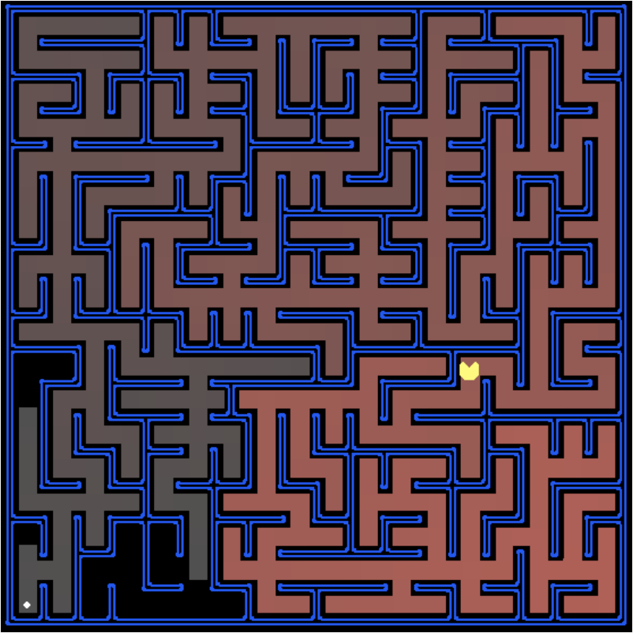
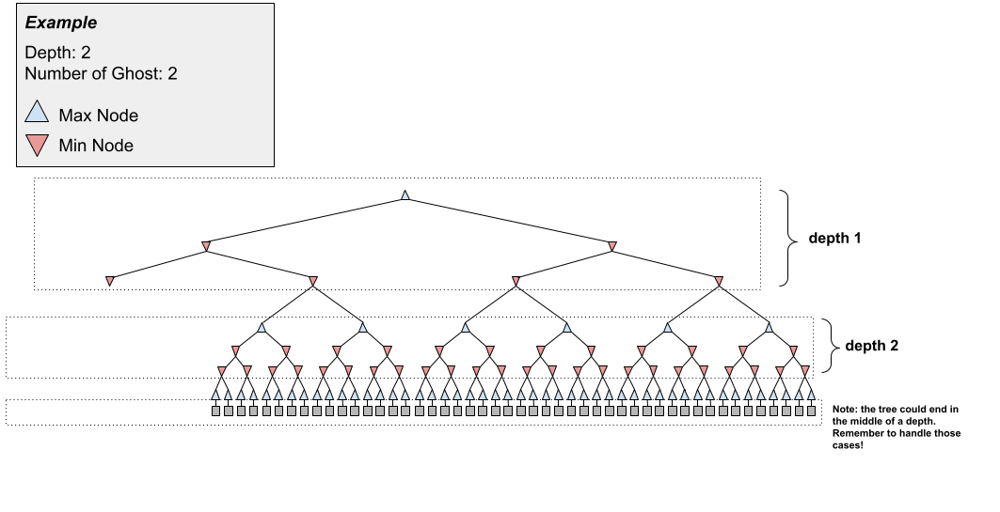

# Project 2: AI-search

## Due February 10 by 23:59 (Start Early!!!!)



--- 

## Introduction

This project consists of two parts: search and multiagent games.

In the search part, your Pacman agent will find paths through his maze world, both to reach a particular location and to collect food efficiently.  You will build general search algorithms and apply them to Pacman scenarios.

In the games part, you will design agents for the classic version of Pacman, including ghosts.  Along the way, you will implement both reflex agents and minimax search and try your hand at evaluation function design.

As in Project 0, this project includes an autograder for you to grade your answers on your machine. This can be run with the command:

```text
python3 autograder.py
```

See the autograder in the tutorial project for more information about using the autograder.

The code for this project consists of several Python files, some of which you will need to read and understand in order to complete the assignment, and some of which you can ignore. 

Files you'll edit:
- `search.py` : Where all of your search algorithms will reside.
- `searchAgents.py` : Where all of your search-based agents will reside.
- `multiAgents.py` : Where all of your multi-agent search agents will reside.

Files you might want to look at:
- `pacman.py` :	The main file that runs Pacman games. This file describes a Pacman GameState type, which you use in this project.
- `game.py` : The logic behind how the Pacman world works. This file describes several supporting types like AgentState, Agent, Direction, and Grid.
- `util.py` : Useful data structures for implementing search algorithms.

Supporting files you can ignore:
- `agentTestClasses.py` : Project 1 specific autograding test classes
- `graphicsDisplay.py` : Graphics for Pacman
- `graphicsUtils.py` : Support for Pacman graphics
- `textDisplay.py` : ASCII graphics for Pacman
- `ghostAgents.py` : Agents to control ghosts
- `keyboardAgents.py` : Keyboard interfaces to control Pacman
- `layout.py` : Code for reading layout files and storing their contents
- `autograder.py` : Project autograder
- `testParser.py` : Parses autograder test and solution files
- `testClasses.py` : General autograding test classes
- `test_cases/` : Directory containing the test cases for each question


**Files to Edit and Submit:** You will fill in portions of `search.py`, `searchAgents.py`, and `multiAgents.py` during the assignment.  Once you have completed the assignment, you will submit a token generated by `submission_autograder.py`. Please do not change the other files in this distribution or submit any of the original files other than these files.

**Evaluation:** Your code will be autograded for technical correctness.  Please do not change the names of any provided functions or classes within the code, or you will wreak havoc on the autograder. However, the correctness of your implementation -- not the autograder's judgements -- will be the final judge of your score.  If necessary, I will review and grade assignments individually to ensure that you receive due credit for your work.

**Academic Dishonesty:** I will be checking your code against other submissions in the class for logical redundancy.  If you copy someone else’s code and submit it with minor changes, I will know. These cheat detectors are quite hard to fool, so please don’t try. I trust you all to submit your own work only; please don’t let me down.  If you do, I will pursue the strongest consequences available to me.

**Getting Help:** You are not alone! If you find yourself stuck on something, contact me via email or office hours.

---

## Welcome to Pacman

After downloading the code, and changing to the directory, you should be able to play a game of Pacman by typing the following at the command line:

```text
python pacman.py
```

Pacman lives in a shiny blue world of twisting corridors and tasty round treats.  Navigating this world efficiently will be Pacman’s first step in mastering his domain.

The simplest agent in `searchAgents.py` is called the `GoWestAgent`, which always goes West (a trivial reflex agent). This agent can occasionally win:

```text
python pacman.py --layout testMaze --pacman GoWestAgent
```

But, things get ugly for this agent when turning is required:

```text
python pacman.py --layout tinyMaze --pacman GoWestAgent
```

If Pacman gets stuck, you can exit the game by typing `CTRL-c` into your terminal.

Soon, your agent will solve not only `tinyMaze`, but any maze you want.

Note that `pacman.py` supports a number of options that can each be expressed in a long way (e.g., `--layout`) or a short way (e.g., `-l`). You can see the list of all options and their default values via:

```text
python pacman.py -h
```

Also, all of the commands that appear in this project also appear in `commands.txt`, for easy copying and pasting. In UNIX/Mac OS X, you can even run all these commands in order with `bash commands.txt`.

---

## Question 1 (2 points): Iterative Deepening
In the `iterativeDeepeningSearch` function in `search.py`, implement an iterative-deepening search algorithm to return the plan - a list of actions - that takes pacman to the goal state.  If there is no valid plan, your function should return an empty list.  Begin by modifying the graph search algorithm **presented in lecture** to implement depth-limited DFS graph search. You will probably want to make use of the `Node` class in `search.py`.

Test your code using:

```text
python3 pacman.py -l threeByOneMaze -p SearchAgent -a fn=ids
```
```text
python3 pacman.py -l testMaze -p SearchAgent -a fn=ids
```
```text
python3 pacman.py -l mediumMaze -p SearchAgent -a fn=ids
```
```text
python3 pacman.py -l contoursMaze -p SearchAgent -a fn=ids
```
```text
python3 pacman.py -l bigMaze -p SearchAgent -a fn=ids -z .5
```

In addition to the Pacman mazes, you can test your code with the autograder given to you.  You can run the full autograder, run any specific question (`-q q*`), or run one specific test case (`-t test_case_path`):

```text
python3 autograder.py
```
```text
python3 autograder.py -q q1
```
```text
python3 autograder.py -t test_cases/q1/graph_backtrack
```

You can see both the test cases and the test solutions by viewing the text in the `*.test` and `*.solution` files, respectively.

A few additional notes:
- In the autograder, "nodes expanded" is equivalent to the nodes on which `getActions` was called. To make the autograder happy, **do the depth check after the goal test but before calling `getActions`**.
- If Pacman moves too slowly for you, try the option `--frameTime 0`.
- All of your search functions need to return a list of actions that will lead the agent from the start to the goal. These actions all have to be legal moves (valid directions, no moving through walls).
- You are implementing **graph search**, not tree search, so IDS might not return the optimal path (to see why we do this, try implementing tree search and running on a maze).
- While the autograder is somewhat lenient regarding tiebreaking, we recommend adding nodes to the frontier in the order in which their actions appear in `problem.getActions()`.

Here are a few files and functions you might find helpful to look at:

- `util.py`: This file contains a Stack class, Queue class, and PriorityQueue class. You should consider using these to implement the frontier.
- `search_and_gamesTestClasses.py`: The `iterativeDeepeningSearch()` function takes in a search problem as its input. To better understand how we define a search problem, take a look at the `GraphSearch()` class. This class contains useful functions. Below are some examples of how you could use these functions:
  + `problem.getStartState()`: returns start state
  + `problem.goalTest(problem.getStartState())`: is the start state a goal state?
  + `problem.getActions(problem.getStartState())`: returns the possible actions you can take from the start state
  + `problem.getResult(problem.getStartState(), action1)`: if you begin in the start state and take action1, this function returns the state you will end up in

Note: Applying `problem.getActions()` and `problem.getResult()` are not just limited to the start state.


---
## Question 2 (2 points): A* Search

Implement A* graph search in the empty function `aStarSearch` in `search.py`.  It should also return a plan - a list of actions - to take Pacman to the goal state.  Once again, it should return an empty list in the failure case. A* takes a heuristic function as an argument.  The `nullHeuristic` heuristic function in `search.py` is a trivial example.

You will probably want to make use of the `Node` class in `search.py` and the `PriorityQueue` class in `util.py`.  Note the difference between the push and the update function.  Make sure you **do not push mutable objects to a priority queue**.  To get around this, wrap a tuple() around each of the sub-elements in the tuple you’re currently pushing.

You can test your A* implementation on the original problem of finding a path through a maze to a fixed position using the Manhattan distance heuristic (implemented already as `manhattanHeuristic` in `searchAgents.py`).

In our implementation, heuristics take two arguments: a state in the search problem (the main argument), and the problem itself (for reference information).

```text
python3.10 pacman.py -l bigMaze -z .5 -p SearchAgent -a fn=astar,heuristic=manhattanHeuristic
```

Our implementation expands (calls `getActions` on) 549 search nodes, but ties in priority may make your numbers differ slightly. How do the various search strategies compare on `openMaze`?


---

---

## Question 3 (3 points): Finding All the Corners

_Note: Make sure to complete Question 2 before working on Question 3, because Question 3 builds upon your answer for Question 2._

The real power of A* will only be apparent with a more challenging search problem.  Now, it’s time to formulate a new problem and design a heuristic for it.

In _corner mazes_, there are four dots, one in each corner.  Our new search problem is to find the shortest path through the maze that touches all four corners (whether the maze actually has food there or not).  Note that for some mazes like `layouts/tinyCorners.lay`, the shortest path does not always go to the closest food first! _Hint_: the shortest path through `tinyCorners` takes 28 steps.

Implement the `CornersProblem` search problem in searchAgents.py.  In particular, you will implement `getStartState` which returns your newly designed start state given the GameState, `goalTest` which tests if a given state of yours is a goal state, and `getResult` which returns a new state given a state and action. You may also add code to `__init__`.

You will need to choose a state representation that encodes all the information necessary to detect whether all four corners have been reached.  Now, your search agent should solve:

```text
python3 pacman.py -l tinyCorners -p SearchAgent -a fn=astar,prob=CornersProblem
```

```text
python3 pacman.py -l mediumCorners -p SearchAgent -a fn=atar,prob=CornersProblem
```

To receive full credit, you need to define an abstract state representation that does not encode irrelevant information (like the position of ghosts, where extra food is, etc.).  In particular, do not use a Pacman `GameState` as a search state.  Your code will be very, very slow if you do (and also wrong).

_Hint_: The only parts of the game state you need to reference in your implementation are the starting Pacman position and the location of the four corners.

_Important_: Do not mutate `state` in `getResult` (e.g., if state contains a list, don’t append to that list). Instead, make a copy of `state` to modify and return.  Since `getResult` is called during the search/path-planning process (not just when Pacman actually takes that action), if the function mutates `state`, the state could pass the goal test earlier than it should (and thus not work correctly).

Our implementation of `aStarSearch` with the null heuristic expands just under 2000 search nodes on `layouts/mediumCorners.lay`.  However, nontrivial heuristics (used with A* search) can reduce the amount of searching required.


---

## Question 4 (3 points): Corners Heuristic
_Note: Make sure to complete Question 2 before working on Question 4, because Question 4 builds upon your answer for Question 2._

Implement a non-trivial, consistent heuristic for the 'CornersProblem' in cornersHeuristic (this can be found in 'searchAgents.py').

For reference, in our implementation, heuristics take two arguments: a state in the search problem (the main argument), and the problem itself.

```text
python3 pacman.py -l mediumCorners -p AStarCornersAgent -z 0.5
```

_Note_: AStarCornersAgent is a shortcut for

`-p SearchAgent -a fn=aStarSearch,prob=CornersProblem,heuristic=cornersHeuristic`.

_*Admissibility vs. Consistency*_: Remember, heuristics are just functions that take search states and return numbers that estimate the cost to a nearest goal.  More effective heuristics will return values closer to the actual goal costs.  To be admissible, the heuristic values must be lower bounds on the actual shortest path cost to the nearest goal (and non-negative).  To be consistent, it must additionally hold that if an action has cost c, then taking that action can only cause a drop in heuristic of at most _c_.

Remember that admissibility isn't enough to guarantee correctness in graph search -- you need the stronger condition of consistency.  However, admissible heuristics are usually also consistent, especially if they are derived from problem relaxations.  Therefore it is usually easiest to start out by brainstorming admissible heuristics.  Once you have an admissible heuristic that works well, you can check whether it is indeed consistent, too.  The only way to guarantee consistency is with a proof.

Consistency can be verified by checking that for each node you expand, its successor nodes are equal or higher in f-value (Reminder that $f=g+h$).  Why is this the case? Recall that for some node $A$ and a successor $B$, $h(A)−h(B)$ is at most $g(B)-g(A)$, i.e., the actual cost of the edge between them, when $h$ is consistent. Rearranging terms, we have that $g(A)+h(A) \le g(B)+h(B)$.  Moreover, inconsistency can often be detected by verifying that for each node you expand, its successor nodes are equal or higher in in f-value.  Moreover, if UCS and A* ever return paths of different lengths, your heuristic is inconsistent. This stuff is tricky!

_*Non-Trivial Heuristics*_: The trivial heuristics are the ones that return zero everywhere (UCS) and the heuristic which computes the true completion cost. The former won't save you any time, while the latter will timeout the autograder. You want a heuristic which reduces total compute time, though for this assignment the autograder will only check node counts (aside from enforcing a reasonable time limit).

_*Grading*_: Your heuristic must be a non-trivial non-negative consistent heuristic to receive any points.  Make sure that your heuristic returns 0 at every goal state and never returns a negative value.  Depending on how few nodes your heuristic expands, you'll be graded:

| **Number of Nodes Expanded** | **Grade** |
|------------------------------|:---------:|
| more than 2000               |    0/3    |
| at most 2000                 |    1/3    |
| at most 1600                 |    2/3    |
| at most 1200                 |    3/3    |

Remember: If your heuristic is inconsistent, you will receive no credit, so be careful!

Some functions at your disposal are `manhattanDistance` in `util.py`, and `mazeDistance` in `searchAgents.py`.  Note that the latter relies on implementation of `breadthFirstSearch` in `search.py`.  Feel free to modify this fuction as desired.

Other general tips for designing heuristics:
- You can try composing multiple heuristics, e.g. with a sum, max, or min.
- Try using the reciprocal of a value to encode features in which larger values are better.  Keep in mind that admissible heuristics cannot be negative.
- Try playing around with different measures of the same general feature.  For example, if distance from the furthest food pellet isn't working out, try distance from the closest, or maybe average distance from any food pellet.


---

## Question 5 (4 points): Eat All The Dots Heuristic

_Note: Make sure to complete Question 2 before working on Question 5, because Question 5 builds upon your answer for Question 2._

Now we'll solve a hard search problem: eating all the Pacman food in as few steps as possible.  For this, we'll need a new search problem definition which formalizes the food-clearing problem: `FoodSearchProblem` in `searchAgents.py` (implemented for you).  A solution is defined to be a path that collects all of the food in the Pacman world.  For the present project, solutions do not take into account any ghosts or power pellets; solutions only depend on the placement of walls, regular food and Pacman. (Of course ghosts can ruin the execution of a solution!  We'll get to that in the next set of questions.)  If you have written your general search methods correctly, A* with a null heuristic (equivalent to uniform-cost search) should quickly find an optimal solution to `layouts/testSearch.lay` with no code change on your part (total cost of 7).

```text
python3 pacman.py -l testSearch -p AStarFoodSearchAgent
```

_Note_: `AStarFoodSearchAgent` is a shortcut for `-p SearchAgent -a fn=astar,prob=FoodSearchProblem,heuristic=foodHeuristic`.

Fill in `foodHeuristic` in `searchAgents.py` with a consistent heuristic for the `FoodSearchProblem`.  Try your agent on the trickySearch board:

```text
python3 pacman.py -l trickySearch -p AStarFoodSearchAgent
```

Our A* agent with the null heuristic finds the optimal solution in about 13 seconds, exploring over 16,000 nodes.

Any non-trivial non-negative consistent heuristic will receive 1 point.  Make sure that your heuristic returns 0 at every goal state and never returns a negative value.  Depending on how few nodes your heuristic expands, you'll get additional points:

| **Number of Nodes Expanded** | **Grade**                            |
|------------------------------|--------------------------------------|
| more than 15000              |    1/4                               |
| at most 15000                |    2/4                               |
| at most 12000                |    3/4                               |
| at most 9000                 |    4/4 (full credit; medium)         |
| at most 6000                 |    5/4 (optional extra credit; hard) |

The same hints mentioned in Q4 about constructing heuristics apply here as well.

Remember: If your heuristic is inconsistent, you will receive no credit, so be careful! Can you solve `layouts/mediumSearch.lay` in a short time?  If so, we're either very, very impressed, or your heuristic is inconsistent.


---

## Question 6 (3 points): Multi-Agent Pacman

Now Pacman will play against other agents, first play a quick game:

```text
python3 pacman.py
```

Now, run the provided `ReflexAgent` in `multiAgents.py`:

```text
python3 pacman.py -p ReflexAgent
```

Note that it plays quite poorly even on simple layouts:

```text
python3 pacman.py -p ReflexAgent -l testClassic
```

Inspect its code (in `multiAgents.py`) and make sure you understand what it's doing.

Improve the `ReflexAgent` in `multiAgents.py` to play respectably by updating the evaluation function which is aptly named `evaluationFunction`.  The evaluation function should return a higher number for a better state and/or action a lower number for a worse state, and it should not search ahead though you can use the resulting successor state.  The provided reflex agent code provides some helpful examples of methods that query the `GameState` for information.  A capable reflex agent will have to consider both food locations and ghost locations to perform well. Your agent should easily and reliably clear the `testClassic` layout:

```text
python3 pacman.py -p ReflexAgent -l testClassic
```

Try out your reflex agent on the default `mediumClassic` layout with one ghost or two (and animation off to speed up the display):

```text
python3 pacman.py --frameTime 0 -p ReflexAgent -k 1

```text
python3.10 pacman.py --frameTime 0 -p ReflexAgent -k 2
```

How does your agent fare?  It will likely often die with 2 ghosts on the default board, unless your evaluation function is quite good.

_Note:_ you can never have more ghosts than the layout permits.

_Note:_ The evaluation function you're writing is evaluating state-action pairs; in later parts of the project, you'll be evaluating states.

_Hint:_ As before, think about how you will encode features in which smaller values are better.  In particular, remember that admissible heuristics cannot be negative.

_Options:_ Default ghosts are random; you can also play for fun with slightly smarter directional ghosts using `-g DirectionalGhost`.  If the randomness is preventing you from telling whether your agent is improving, you can use `-f` to run with a fixed random seed (same random choices every game).  You can also play multiple games in a row with `-n`. Turn off graphics with `-q` to run lots of games quickly.

Grading: we will run your agent on the `smallClassic` layout 10 times.

- You will receive 0 points if your agent times out, or never wins.
- You will receive 1 point if your agent wins at least 5 times, or 2 points if your agent wins all 10 games.
- You will receive an additional 1 point if your agent's average score is greater than 1000.
- You can try your agent out under these conditions with

```text
python3 autograder.py -q q6
```
To run it without graphics, use:

```text
python3 autograder.py -q q6 --no-graphics
```

Don't spend too much time on this question, though, as there is more work to be done in the last several questions.


---

## Question 7 (2 points): Minimax

Now you will write an adversarial search agent's `getAction` function in the provided `MinimaxAgent` class stub in `multiAgents.py`.  Your `getAction` function should use minimax to select which action Pacman will take.  Your minimax implementation should work with any number of ghosts, so you'll have to write an algorithm that is slightly more general than what you've previously seen in lecture.  In particular, your minimax tree will have multiple min layers (one for each ghost) for every max layer.

Your code should also expand the game tree to an arbitrary depth. Score the leaves of your minimax tree with the supplied `self.evaluationFunction`, which defaults to `scoreEvaluationFunction`.  `MinimaxAgent` extends `MultiAgentSearchAgent`, which gives access to `self.depth` and `self.evaluationFunction`.  Make sure your minimax code makes reference to these two variables where appropriate as these variables are populated in response to command line options.

_Important:_ A single search ply is considered to be one Pacman move and all the ghosts' responses, so depth 2 search will involve Pacman and each ghost moving two times.



_Important:_ If there are no legal actions from a state to perform the min or max over, the state is a leaf even if it is not at the depth specified.  In this case, you should return the value of evaluationFunction on the state.

_Important:_ Important: Alpha-Beta pruning is just one type of adversarial search.  If you attempt to implement Alpha-Beta pruning exactly as seen in lecture, the autograder will fail as pruning branches causes `GameState.generateSuccessor' to be called less than expected.  That being said, it might be useful to generalize the logic behind alpha-beta pruning to decide when to prune a node.

_Grading:_ We will be checking your code to determine whether it explores the correct number of game states. This is the only way reliable way to detect some very subtle bugs in implementations of minimax.  As a result, the autograder will be very picky about how many times you call `GameState.generateSuccessor`.  If you call it any more or less than necessary, the autograder will complain.  To test and debug your code, run

```text
python3 autograder.py -q q7
```

This will show what your algorithm does on a number of small trees, as well as a pacman game.  To run it without graphics, use:

```text
python3 autograder.py -q q7 --no-graphics
```

### Hints and Observations

- The correct implementation of minimax will lead to Pacman losing the game in some tests.  This is not a problem: as it is correct behavior, it will pass the tests.
- The evaluation function for the Pacman test in this part is already written (`self.evaluationFunction`).  You shouldn't change this function, but recognize that now we're evaluating *states* rather than actions, as we were for the reflex agent.  Look-ahead agents evaluate future states whereas reflex agents evaluate actions from the current state.
- Pacman is always agent 0, and the agents move in order of increasing agent index.
- All states in minimax should be `GameStates`, either passed in to `getAction` or generated via `GameState.generateSuccessor`.  In this project, you will not be abstracting to simplified states.
- The minimax values of the initial state in the `minimaxClassic` layout are 9, 8, 7, -492 for depths 1, 2, 3 and 4 respectively.  Note that your minimax agent will often win (665/1000 games for us) despite the dire prediction of depth 4 minimax.

```text
python3 pacman.py -p MinimaxAgent -l minimaxClassic -a depth=4
```
- On larger boards such as `openClassic` and `mediumClassic` (the default), you'll find Pacman to be good at not dying, but quite bad at winning.  He'll often thrash around without making progress.  He might even thrash around right next to a dot without eating it because he doesn't know where he'd go after eating that dot.  Don't worry if you see this behavior, question 9 will clean up all of these issues.
- When Pacman believes that his death is unavoidable, he will try to end the game as soon as possible because of the constant penalty for living. Sometimes, this is the wrong thing to do with random ghosts, but minimax agents always assume the worst:

```text
python3 pacman.py -p MinimaxAgent -l trappedClassic -a depth=3
```
Make sure you understand why Pacman rushes to the closest ghost in this case.


---

## Question 8 (2 points): Expectimax

Minimax and alpha-beta are great, but they both assume that you are playing against an adversary who makes optimal decisions.  As anyone who has ever won tic-tac-toe can tell you, this is not always the case.  In this question you will implement the `ExpectimaxAgent`, which is useful for modeling probabilistic behavior of agents who may make suboptimal choices.  Implement the agent's `getAction` function to select the best action using the expectimax algorithm.

As with the search and constraint satisfaction problems covered so far in this class, the beauty of these algorithms is their general applicability. To expedite your own development, we've supplied some test cases based on generic trees. You can debug your implementation on small game trees using the command:

```text
python3 autograder.py -q q8
```
Debugging on these small and manageable test cases is recommended and will help you to find bugs quickly.

Once your algorithm is working on small trees, you can observe its success in Pacman.  Random ghosts are of course not optimal minimax agents, and so modeling them with minimax search may not be appropriate.  `ExpectimaxAgent`, will no longer take the min over all ghost actions, but the expectation according to your agent's model of how the ghosts act. To simplify your code, assume you will only be running against an adversary which chooses amongst their `getLegalAction`s uniformly at random.

To see how the ExpectimaxAgent behaves in Pacman, run:

```text
python3 pacman.py -p ExpectimaxAgent -l minimaxClassic -a depth=3
```

You should now observe a more cavalier approach in close quarters with ghosts. In particular, if Pacman perceives that he could be trapped but might escape to grab a few more pieces of food, he'll at least try.

The correct implementation of expectimax will lead to Pacman losing some of the tests. This is not a problem: as it is correct behavior, it will pass the tests.


---

## Question 9 (4 points): Evaluation

Write a better evaluation function for Pacman in the provided function `betterEvaluationFunction`.  The evaluation function should evaluate states, rather than actions like your reflex agent evaluation function did.  You may use any tools at your disposal for evaluation, including your search code from the previous parts.  With depth 2 search, your evaluation function should clear the `smallClassic` layout with one random ghost more than half the time and still run at a reasonable rate (to get full credit, Pacman should be averaging around 1000 points when he's winning).

```text
python3 autograder.py -q q9
```

Grading: the autograder will run your agent on the `smallClassic` layout 10 times.  We will assign points to your evaluation function in the following way:

- If you win at least once without timing out the autograder, you receive 1 point. Any agent not satisfying these criteria will receive 0 points.
- +1 for winning at least 5 times, +2 for winning all 10 times
- +1 for an average score of at least 1000 (including scores on lost games)
- +1 if your games take on average less than 30 seconds on the autograder machine. The autograder is run on Gradescope, so this machine will have a fair amount of resources, but your personal computer could be far less performant (netbooks) or far more performant (gaming rigs).
- The additional points for average score and computation time will only be awarded if you win at least 5 times.

### Hints and Observations

- Check the definition of GameState in `pacman.py` to understand the state information available to you.
- As for your reflex agent evaluation function, you may want to use the reciprocal of important values (such as distance to food) rather than the values themselves.
- One way you might want to write your evaluation function is to use a linear combination of features. That is, compute values for features about the state that you think are important, and then combine those features by multiplying them by different values (weights) and adding the results together. You might decide how to weight each feature based on how relevant you think it is.
- Some features you may want to consider are: Pacman's distance from ghosts, distance from food, distance from scared ghosts, and distance from power pellets.  You can access power pellets via `currentGameState.getCapsules`, defined in `pacman.py`, and a ghost's scared status via the `scaredTimer` field of a ghost's `AgentState` (`game.py`).  To access all ghosts' `AgentStates`, call `currentGameState.getGhostStates`.
- Debug your code on really simple layouts: `python3.10 pacman.py -p ExpectimaxAgent -l threeByOneMaze -a evalFn=better`
  